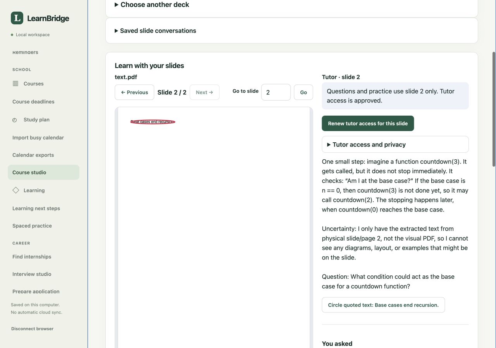

# Done list and interactive learning studios

## Goal and implementation order

A student should be able to see current commitments, start useful agent work from a task, open the conversation and inspect the result. Course material should be visible beside a source-aware tutor, with practice questions and optional spoken interaction. Interview preparation should use the same loop: a real question, the student's attempt and grounded feedback.

The local edition is the implementation target. The hosted website stays separate and cannot reach an arbitrary visitor's laptop. Device/account integration release checks are not replaced by synthetic tests.

1. **Selected-source task reconciliation.** Persist which saved academic, calendar, update and project sources are enabled. Normalize exact source identities, keep duplicates out, show uncertainty and refresh time. Automatic creation/completion requires the student's explicit scope policy; absence, elapsed time, reading or an AI claim cannot mean completed. Changed tasks and manual overrides require reconciliation. Existing selected cloud/D2L acquisition feeds the saved sources; this feature does not secretly scan accounts.
2. **Task-linked execution.** `task-session-service.mjs` creates a saved conversation with the exact task revision and optional exact note revisions. A paired start action grants only those records to the official local Codex host for 60 minutes. The model works in the background and can prepare bounded local task/writing proposals. Queued, working, stopped, failed, unknown and ready-for-review are distinct. Repeated clicks execute once. Follow-up sessions include only a current approved previous result for the same task.
3. **Course studio.** An anchored original PDF page renders locally to an image aligned with annotations. The imported page text, original-byte hash and chosen course context stay pinned. Student questions launch actual Codex turns after separate sharing review. Quiz and pointing outputs are bounded model proposals that must match the current source. Attempts are saved before feedback; no inference of mastery from activity. Optional browser speech is user initiated.
4. **Interview studio.** Select a role and confirmed profile evidence, choose technical/behavioral practice, and work one question at a time. Save the student's actual response before model feedback. Preserve selected source revisions, round state, rubric, history and uncertain assessments. No fabricated achievements or hiring outcome claims.
5. **External application browser preparation.** A separate narrowly authorized browser capability is needed to open an official posting and prepare an employer form. The current embedded host cannot browse, execute shell, upload or submit; it must say so instead of inventing progress. The implemented owned temporary Chrome browser uses exact current Greenhouse/Lever destinations and reviewed top-level text fields. It freezes page script and all network before native field setters, independently reads back values, and links preparation receipts to the task session. Uploads, clicks, protected fields, iframes and final submission are unavailable. Live ATS compatibility requires actual site verification; a fixture filled successfully is insufficient. Final application submission remains the student's decision.

## Task session contract

`POST /api/local/v1/task-sessions` requires `task_id`, `expected_revision`, `documents:[{id,revision,sha256}]`, `instructions`, `confirmed:true` and a stable idempotency key. An optional `previous_session_id` must identify a completed current result for the same task. Arbitrary commands, hosts, credentials, source paths and destinations are rejected.

`GET /task-sessions` and `GET /task-sessions/:id` return linked turn IDs, observed tool progress, actual result text and source-current status. Results are withheld when exact task/source/grant authority changes. `POST /:id/cancel` requires exact session and turn revisions. `POST /:id/complete` additionally requires the current task revision and the student's completion evidence. Model success does not automatically mark a task done. The completion receipt links reviewer, actual output hash and task revision. Explicit completion retains the reviewed result as local history, even though the completed task revision ends the original sharing grant. That accepted copy does not expand model access; later task edits invalidate its done status. Historical database revisions and backups may retain the copy.

Host conversation completion is distinct from task completion. A document proposal is distinct from an accepted document. An accepted local document is distinct from a provider edit or employer submission. The interface must keep those distinctions visible.

## Objective acceptance loop

| Flow | Pass condition | Verification |
| --- | --- | --- |
| Source refresh | Same account/source identity yields one task; new versions explain changes; removed items do not delete manual work | Domain fixtures, actual paired HTTP refresh, independent saved record readback |
| Background start | One exact saved task maps to one host request and observed tool events | Task-session unit/HTTP tests, then actual official host turn on synthetic selected context |
| Retry/cancel/restart | Retry does not run twice; stopped output is withheld; restart never silently replays inference | Delayed executor tests, persisted database reopen, real UI stop where available |
| Privacy | No unselected note/source/profile is included; hostile origin/nonce/extra execution fields fail | Grant pin inspection and paired HTTP denial tests |
| Completion | Task stays pending after model answer; exact reviewed evidence is required to mark done | Independent task/status/receipt readback, stale revision rejection |
| PDF question | Displayed page and question evidence share original hash and physical page | Real selected PDF rendering, pixel inspection, mismatched/changed-file rejection, live sourced tutor answer |
| Quiz | Actual generated questions parse within bounds and cite selected evidence; feedback uses saved student attempt | Malformed output refusal, quiz attempt tests, actual question/attempt UI readback |
| Interview | One active round, response before feedback, current role/profile pins, recoverable history | Unit/HTTP state-transition tests, actual browser practice loop, live model question and feedback |
| Voice | Explicit start/stop and supported-browser state; unavailable input remains usable as text | Feature detection, microphone denial/stop fixtures, real audio verification before claiming spoken conversation works |
| Browser applications | Exact fields prepared, final submit remains untriggered, form identity remains current | Controlled browser fixture plus a selected real ATS read/prepare check, zero submissions |

After each slice, run its domain/HTTP checks, exercise the actual UI, read back persistence independently, and repair mismatches. Once integrated, run the full repository suite, local static build and hosted build. Verification reports must separate mocked model results, actual native rendering, actual model turns and live external accounts/devices.

## Implemented contracts

- [Dynamic selected-source Done list](DYNAMIC_DONE_LIST.md): accounts and sources, reconciliation, AI quoted suggestions, sorting and progress.
- [Interactive Course studio](INTERACTIVE_COURSE_STUDIO.md): natural slideshow navigation, exact source text, quiz attempts and native circles.
- [Interview studio](LOCAL_INTERVIEW_STUDIO.md): question/answer/coaching rounds and persistent review.
- [Application preparation browser](LOCAL_APPLICATION_BROWSER.md): owned Chrome, exact checked values, network freeze and zero-submit boundaries.

The coaching and task-extraction turns use a trusted read-only tool policy. Task agents may make bounded pending proposals for human review. Neither policy enables native shell, general browsing, provider writes or accepted changes.

## Recorded October 5 result

Code `72f20f4` passed **1,408 automated tests with zero skips**, both builds and all nine clean-copy installation phases. Actual official Codex task work, quiz generation, quoted email extraction and interview coaching passed separately from simulated model tests. Browser navigation, guarded keyboard controls, native circles, exact task-completion review and desktop/mobile layout passed. Seven independently compared SQLite tables matched a fresh restore; accepted task results, practice attempts/circles and interview history reopened without enabling the AI host. See the [source-bound verification receipt](DONE_LIST_STUDIOS_VERIFICATION.json) for exact scope and remaining live gates.

